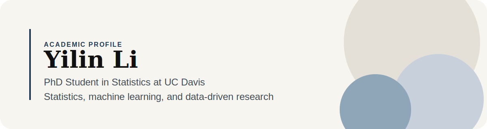

# Hi there, I'm Yilin Li

<div align="center">
  
</div>

<br />

<div align="center">
  <a href="https://github.com/yilinli101">
    
  </a>
  <a href="mailto:chloeliyilin@gmail.com">
    
  </a>
</div>

<p align="center">
  <strong>PhD Student in Statistics @ UC Davis</strong><br />
  Statistics, machine learning, and thoughtful research-driven building
</p>

## About Me

I am a PhD student in Statistics at UC Davis with a background across statistics, data science, and computation. I enjoy working on problems that sit between rigorous methodology and practical impact.

- Current role: PhD Student in Statistics at UC Davis
- Academic interests: statistics, machine learning, and data-driven research
- Based in: California
- Open to: academic collaborations, research conversations, and interesting projects

## What I Care About

- Clear statistical thinking
- Research with real-world relevance
- Building useful tools to support learning and discovery

## Education

- **University of California, Davis**  
  PhD in Statistics

- **University of California, Berkeley**  
  Master's degree

- **Southern University of Science and Technology (SUSTech)**  
  Bachelor's degree

## Tech Stack

<p>
  
  
  
  
  
  
  
  
  
</p>

## Research Interests

- Statistical methodology
- Machine learning
- Data analysis
- Computational research workflows

## Selected Work

I am currently organizing projects, papers, and research work to feature here.

## GitHub Stats

<div align="center">
  
  
</div>

## A Few Things About Me

```text
Name: Yilin Li
Role: PhD Student in Statistics
Institution: UC Davis
Previous study: UC Berkeley, SUSTech
Focus: Statistics, machine learning, research
```

## Let's Connect

If you would like to connect about research, statistics, machine learning, or collaboration opportunities, feel free to reach out.

- GitHub: `https://github.com/yilinli101`
- Email: `chloeliyilin@gmail.com`
